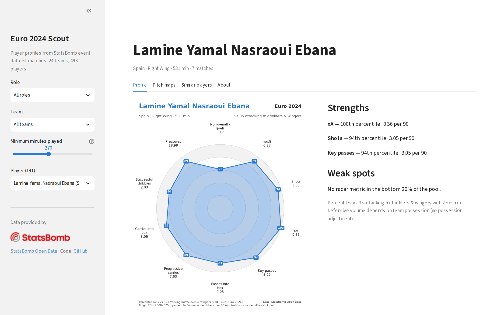
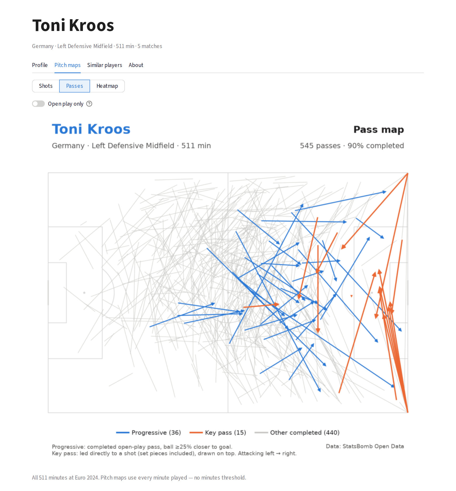
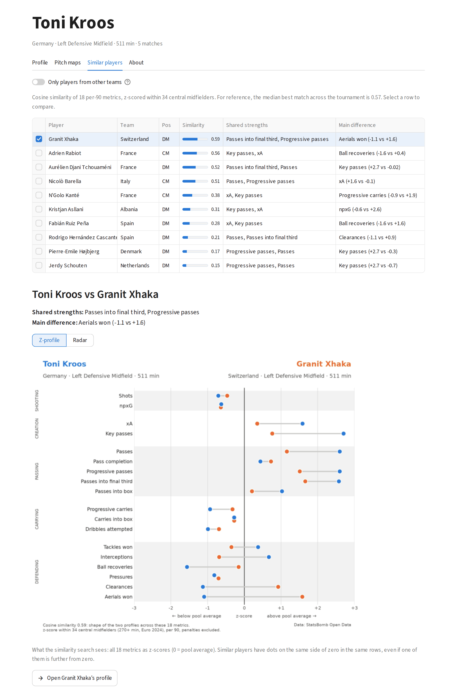

# Euro 2024 Scout

[](https://github.com/01IVAN10/Football-Analytics/actions/workflows/tests.yml)

A scouting tool built on StatsBomb open event data for UEFA Euro 2024 (51 matches, 493 players).

**Live app: [euro2024-scout.streamlit.app](https://euro2024-scout.streamlit.app)**



- **Player profiles**: per-90 metrics and percentile radars, compared within role
  (6 comparison pools, players with 270+ minutes), strengths and weak spots.
- **Pitch maps** for every player: shots sized by xG, progressive and key passes
  (with an open-play filter), smoothed heatmaps.
- **Similar players**: 18-metric profiles z-scored within role and compared with cosine
  similarity, with the shared strengths and the main difference for every match.
  [Validated](#validation-of-the-similarity-search) on a split-half test.

<table>
  <tr>
    <td width="50%" valign="top"></td>
    <td width="50%" valign="top"></td>
  </tr>
  <tr>
    <td align="center">Pitch maps: Toni Kroos' progressive and key passes</td>
    <td align="center">Similar players: who plays like Kroos, and how they differ</td>
  </tr>
</table>

Every view has a shareable URL, e.g.
[Toni Kroos' similar players](https://euro2024-scout.streamlit.app/?player=Toni+Kroos+%28Germany%29&tab=Similar+players).

> The app runs on Streamlit Community Cloud and falls asleep after 12 hours without visitors.
> If you see "This app has gone to sleep", wake it up and give it ~30 seconds.

## Methodology

**Minutes.** Calculated from the events (starting XI, substitutions, red cards) as time
actually played, including stoppage time and extra time, excluding penalty shootouts.
Check: the minutes of each team add up to 11 × match length, unless someone was sent off.
StatsBomb lineups were not used: their position timeline is broken in extra-time matches.

**Positions and pools.** A player's position is the one he is listed at most often in the
events, grouped into GK, CB, FB, DM, CM, AM, W and FW. Percentiles and similarity are
computed within 6 comparison pools (DM+CM and AM+W are merged: with 270+ minutes there
are only 8 CMs and 15 AMs).

**Metrics.** 21 counting metrics per 90 minutes for the 191 players with 270+ minutes
(3 full matches): shooting and xG without penalties, xA, progression, carries, defensive
actions. A progressive pass or carry moves the ball at least 25% closer to goal; set pieces
never count as progression. Non-penalty goals and assists of the top scorers and assist
leaders match the official tournament numbers. Full definitions: [data/export/README.md](data/export/README.md).

**Similar players.** Each player is a vector of 18 per-90 metrics, converted to z-scores
within his pool, so that every metric is in the same units ("standard deviations above the
average player in this role"). Similarity is the cosine between two vectors: it compares the
*shape* of a profile, not its level, so a player who does the same things less often still
counts as similar. Goals and assists are left out (outcomes, mostly luck over 3–7 matches),
as are metrics that duplicate another one (successful dribbles correlate 0.92 with attempts).
Every match is explained: *shared strengths* are the metrics that add most to the cosine where
both players are above average; the *main difference* is the largest gap between metrics
where one player is above and the other below average.

### Validation of the similarity search

There is no ground truth for "who plays like whom", so the test checks a necessary
property instead: a good method should recognise a player from his *other* matches.
Each player's matches are split alternately into two halves (1st, 3rd, 5th... vs 2nd, 4th...),
giving two independent profiles for 167 players with 90+ minutes in each half. For every
half-profile, all other-half profiles in the same pool are ranked by similarity
(334 trials). *Rank score* = 1 if the player's own other half comes first, 0.5 = random.

Each row changes exactly one decision. The difference to the chosen method is tested with a
paired bootstrap over players (2,000 resamples, 95% interval):

| Variant | Rank score | Top-1 | Top-3 | Difference [95% CI] | Verdict |
|---|---|---|---|---|---|
| **Chosen: z-score + cosine, 18 metrics** | **0.747** | **17.4%** | **34.7%** | | |
| Euclidean distance instead of cosine | 0.704 | 18.3% | 31.1% | +0.042 [+0.020, +0.065] | chosen is better |
| Percentiles instead of z-scores | 0.742 | 16.2% | 33.8% | +0.005 [−0.010, +0.020] | no difference |
| No scaling | 0.725 | 17.1% | 30.5% | +0.022 [−0.017, +0.062] | no difference |
| 10 radar metrics instead of 18 | 0.729 | 13.8% | 33.5% | +0.017 [−0.009, +0.045] | no difference |
| 18 metrics + goals and assists | 0.745 | 16.8% | 32.6% | +0.002 [−0.004, +0.007] | no difference |
| Random choice | 0.500 | 3.0% | 9.0% | | |

What this shows, and what it does not:

- The method picks up a stable playing style: it ranks a player's own other half above
  ~75% of candidates, and finds it first ~6 times more often than chance.
- Only one design decision is supported by the data: cosine beats Euclidean distance
  (top-1 is slightly higher for Euclidean, but top-1 is noisy, about ±4 points).
- The test cannot tell the other variants apart, so those choices rest on reasoning, not on
  the test. Without scaling, for example, the cosine is dominated by pass volume (the largest
  numbers). That is stable, so the test rewards it, but it is a poor description of style.
  The test measures how *stable* a profile is, not how *complete* it is.

### Limitations

- **Small samples**: 3–7 matches per player; the forward pool has only 17 players.
- **No possession adjustment**: players in teams that defend a lot have more chances to
  tackle and intercept.
- **No goalkeeper metrics**: goalkeepers have no radar and no similar players.
- **Event data only**: nothing about off-ball movement or positioning without the ball.
  The numbers say where to look; video decides.

## Open dataset

The per-90 metrics, percentiles and tournament totals are in
[`data/export/`](data/export/) as CSV, with
[column definitions](data/export/README.md). A test checks that they match the code.

## Run locally

```bash
python -m venv .venv && source .venv/bin/activate
pip install -r requirements-dev.txt
streamlit run streamlit_app.py
python -m pytest tests/ -q          # app smoke tests (Streamlit AppTest) + dataset check
```

Tests also run on GitHub Actions for every push and pull request.

The app reads the slim data committed in `data/app/` (~1 MB). To rebuild everything from the StatsBomb API:

```bash
python -m src.data_loader   # download 51 matches -> data/raw
python -m src.metrics       # minutes, per-90 metrics -> data/processed
python -m src.app_data      # slim app data -> data/app (with a consistency check)
python -m src.export_data   # open dataset -> data/export
```

## Structure

| Module | What it does |
|---|---|
| `src/minutes.py` | Minutes played from events (substitutions, red cards, stoppage time) |
| `src/metrics.py` | 21 counting metrics + ratios, per 90 minutes |
| `src/percentiles.py` | Comparison pools and percentiles within role |
| `src/radar.py`, `src/pitch_maps.py`, `src/z_profile.py` | Charts (matplotlib + mplsoccer) |
| `src/similarity.py` | Similar players: z-scores + cosine similarity |
| `src/validate_similarity.py` | Split-half validation with a paired bootstrap |
| `src/app_data.py`, `src/export_data.py` | Slim app data, open CSV dataset |
| `streamlit_app.py` | Web app |
| `tests/` | Smoke tests of every page, dataset consistency |

Each module also runs from the command line, e.g. `python -m src.radar "kane"` or
`python -m src.similarity "xhaka" --other-teams`.

## Data


Data: [StatsBomb Open Data](https://github.com/hudl/open-data), used under their terms
(state the source and show the StatsBomb logo).
